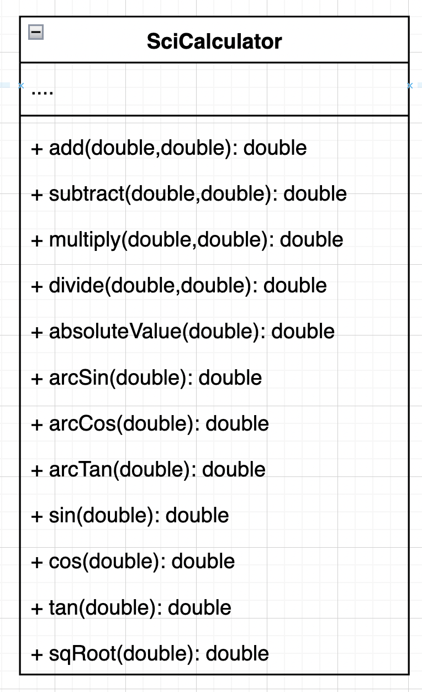

# Part A - TDD in Java 

## Unit Testing and TDD

**Imagine you're assembling a puzzle.**

Each individual piece of the puzzle can be seen as a small part of a bigger picture (or software in our case). Before you put two pieces together, you make sure that they fit perfectly. This is like checking that a small part of your program works correctly on its own.

---

**Unit Testing**

Unit testing is like examining each puzzle piece individually. For each piece (or "unit" of your software), you:

1. **Check its shape** to ensure it's correct.
2. **Try fitting it** with its neighboring pieces to ensure it connects properly.

In programming, "checking the shape" is like making sure a small part of your code (a function or method) does what it's supposed to do. For instance, if you have a function that adds two numbers, you'd run a test to ensure that when you input `2` and `3`, you get `5` as the result.

The main benefits of unit testing are:
1. Ensuring each part of your software works correctly.
2. Making it safer to change and improve your software in the future, because you can quickly check that everything still works after the changes.

---

**Test-Driven Development (TDD)**

Now, imagine instead of starting your puzzle by trying to put pieces together randomly, you first look at the box's picture. Then, based on that picture, you **predict** where each piece should go, even before trying to fit it. If the piece fits where you predicted, great! If not, you make changes until it does.

In TDD:
1. **Predict the Outcome**: Before writing the actual code, you write a test that describes how a part of your software should work. This test will fail initially because there's no code to make it pass.
2. **Assemble the Puzzle**: Then, you write the code to make the test pass (or make the puzzle piece fit).
3. **Refine if Needed**: Once the test passes, you can improve your code, making sure that the test still passes after your changes.

The main steps of TDD are often summarized as: **Red** (write a failing test) → **Green** (make the test pass) → **Refactor** (improve the code).

The benefits of TDD include:
1. Making sure your software works correctly as you build it.
2. Producing clearer, more maintainable code.
3. Helping you think about how your software should work before diving into writing it.

---

**In Summary**:

- **Unit Testing**: It's like checking individual puzzle pieces to ensure they fit as expected.
- **TDD**: It's a way of building puzzles where you first predict where a piece should fit, then try to fit it, and then refine if needed.

By using unit tests and TDD, developers can be more confident that their software works correctly and can be safely changed and improved over time.

## Summary: What is TDD

“Test-driven development” refers to a style of programming in which three activities are tightly interwoven: coding, testing (in the form of writing unit tests) and design ( in the form of refactoring)

**Refactoring** -  the process of restructuring computer code without changing or adding to its external behavior and functionality.

**Unit Test** -  the smallest piece of code that can be logically isolated in a system. In most programming languages, that’s a function, sub-routine or method.

## The TDD Process
* Write a test
* Run a test and see if it fails (Yay Failure!!)
* Write code
* Run the tests again (Hopefully it passes)
* Rewrite / Refactor code to make it more efficient
* Run Test again to make sure you didn’t break anything.


## Watch this video
[Video](https://vimeo.com/manage/videos/673332417)


## F.I.R.S.T

The first acronym is used to make sure that the test we write are following the best practices.

* **F**ast - test should pass or fail quickly
* **I**ndependent -no tests should depend on another test, no class should depend on another class, or external service.
* **R**epeatable - run N times , get the same result N times ( to help isolate bugs and enable automation)
* **S**elf-checking: test can automatically detect if they pass or fail. Test should come to one binary conclusion. Yes or No.
* **T**imely - written about the same time as our code. (This won’t be a problem because we are writing them before we write our code.)


## How To Judge Code

One of the most important skills to develop as a engineer, is to be able to consistantly identify what is good or bad code. The way's that we judge if code is crap, is using design patterns, and design principles.

* F.I.R.S.T.

These principles should be the bedrock you use to read / design / and judge not only your code, but any code you choose to use in the future.

Any thing you find that isn't accompanied with approrate UNIT Test, should not be trusted.


## Assignment

This is the UML for the assignment. To complete, each function needs to be created and completed. In addition, there should be atleast 3 unit test for each method.





# Part B - Lab: Polymorphism in a Pet Store

### Introduction: 
This lab is designed to help you understand the principles of polymorphism using a real-world example: a pet store. As pet stores contain various types of animals, we'll see how to manage these animals and keep them organized using object-oriented concepts in Java.

### Objective:
To understand the principles of polymorphism by modeling a pet store system where animals of similar types are stored together.

### Prerequisites:
- Basic understanding of Java.
- Familiarity with object-oriented concepts such as classes, inheritance, and interfaces.
- A Java IDE (e.g., Eclipse, IntelliJ IDEA) and JUnit for testing.
**1. Base Class:**

### Steps:
#### 1. **Setting up the Base Class**:

- Create an `Animal` abstract class. This class will represent any animal that could be in the pet store.

```java
public abstract class Animal {
    private String name;

    public Animal(String name) {
        this.name = name;
    }

    public String getName() {
        return name;
    }

    // Every animal makes a sound. Let's make this method abstract.
    public abstract String makeSound();
}
```
- Comment: The `makeSound()` is abstract because every animal will have a unique sound.

**2. Concrete Cat Classes:**

- Implement specific animal types like `Cat` and `Dog`. Each of these classes will extend the `Animal` class.

```java
public class Cat extends Animal {
    public Cat(String name) {
        super(name);
    }

    @Override
    public String makeSound() {
        return "Meow!";
    }
}
```

**1. CatTest.java:**

This will test the behaviors specific to the `Cat` class.

```java
import org.junit.jupiter.api.BeforeEach;
import org.junit.jupiter.api.Test;
import static org.junit.jupiter.api.Assertions.assertEquals;

public class CatTest {

    private Cat cat;

    @BeforeEach
    public void setUp() {
        cat = new Cat("Whiskers");
    }

    @Test
    public void testMakeSound() {
        assertEquals("Meow!", cat.makeSound());
    }

    // Add any other tests specific to the Cat class here.
}
```

```java
public class Dog extends Animal {
    public Dog(String name) {
        super(name);
    }

    @Override
    public String makeSound() {
        return "Woof!";
    }
}

// ... More animals as desired.
```
**DogTest.java:**

This will test the behaviors specific to the `Dog` class.

```java
import org.junit.jupiter.api.BeforeEach;
import org.junit.jupiter.api.Test;
import static org.junit.jupiter.api.Assertions.assertEquals;

public class DogTest {

    private Dog dog;

    @BeforeEach
    public void setUp() {
        dog = new Dog("Rex");
    }

    @Test
    public void testMakeSound() {
        assertEquals("Woof!", dog.makeSound());
    }

    // Add any other tests specific to the Dog class here.
}
```

**3. Cage Class:**

- Build the `Cage` class. This class will ensure animals of the same type are kept together.
- Use generics to allow for different animal types.

```java
public class Cage<T extends Animal> {
    private List<T> animals;

    public Cage() {
        this.animals = new ArrayList<>();
    }

    public void addAnimal(T animal) {
        animals.add(animal);
    }

    public List<T> getAnimals() {
        return animals;
    }

    // Example: You can create methods to interact with animals in the cage.
    public String makeAllSounds() {
        String response = "";
        for (T animal : animals) {
            response  += (animal.makeSound();
        }
        return response;
    }
}
```

**4. Cage Test Class:**

```java
import org.junit.jupiter.api.BeforeEach;
import org.junit.jupiter.api.Test;
import static org.junit.jupiter.api.Assertions.assertEquals;
import static org.junit.jupiter.api.Assertions.assertTrue;

public class CageTest {

    private Cage<Cat> catCage;
    private Cage<Dog> dogCage;

    @BeforeEach
    public void setUp() {
        catCage = new Cage<>();
        dogCage = new Cage<>();
    }

    @Test
    public void testAddCat() {
        Cat whiskers = new Cat("Whiskers");
        catCage.addAnimal(whiskers);

        assertEquals(1, catCage.getAnimals().size());
        assertTrue(catCage.getAnimals().contains(whiskers));
    }

    @Test
    public void testMakeCatSounds() {
        Cat whiskers = new Cat("Whiskers");
        Cat fluffy = new Cat("Fluffy");

        catCage.addAnimal(whiskers);
        catCage.addAnimal(fluffy);

        String expectedSound = "Meow!Meow!";
        assertEquals(expectedSound, catCage.makeAllSounds());
    }

    @Test
    public void testAddDog() {
        Dog rex = new Dog("Rex");
        dogCage.addAnimal(rex);

        assertEquals(1, dogCage.getAnimals().size());
        assertTrue(dogCage.getAnimals().contains(rex));
    }

    @Test
    public void testMakeDogSounds() {
        Dog rex = new Dog("Rex");
        Dog buddy = new Dog("Buddy");

        dogCage.addAnimal(rex);
        dogCage.addAnimal(buddy);

        String expectedSound = "Woof!Woof!";
        assertEquals(expectedSound, dogCage.makeAllSounds());
    }

    // Add any other tests as necessary.
}

```

### Conclusion:
After completing this lab, you should be able to:

- Understand how polymorphism allows us to treat different objects in a unified way.
- Use generics in Java to ensure type safety.
- Use JUnit for testing individual classes and their behaviors.

### Challenge:
For those who finish early and want an additional challenge:

1. Implement more animal types (e.g., `Bird`, `Fish`).
2. Enhance the cage class to include methods like `removeAnimal()` or `findAnimalByName()`.

Good luck and enjoy your time at the pet store! 🐶🐱🐦🐠**